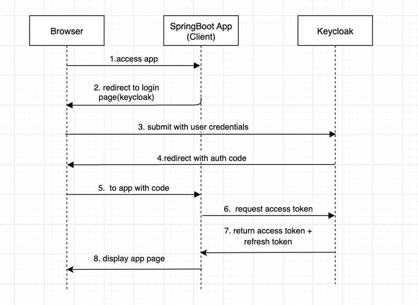

# Keycloak Front End
This is a demo application that will connect to key cloak for authentication using Authorization Code Flow with openID connect.

This example uses spring security

---

---

### References

* [Oauth2 with keycloak as provider](https://ravthiru.medium.com/springboot-oauth2-with-keycloak-as-provider-c31b2897e913)
* [Keycloak spring boot starter](https://www.keycloak.org/docs/latest/securing_apps/#_spring_boot_adapter)

